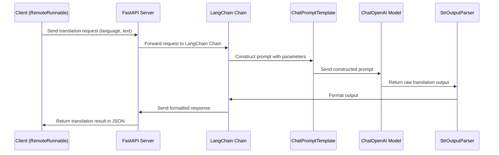

# AREP-LAB05
LAB 08 - AREP

# Introduction to Creating RAGs (Retrieval-Augmented Generators) with OpenAI

## Introduction

This lab is designed to introduce students to the fundamental concepts and practical implementation of Retrieval-Augmented Generators (RAGs) using OpenAI’s tools and LangChain framework. By the end of the lab, students will have gained hands-on experience building and understanding RAGs, culminating in the delivery of two GitHub repositories showcasing their work.

## Application description

The developed application is a manager for a property list. It allows users to add property to a list along with a detailed description to facilitate organization and tracking during shopping. The application demonstrates how the web server can handle requests to add property, list existing property, and serve static content such as HTML, using Spring Boot frameworks.

## Starting

The following instructions will allow you to get a working copy of the project on your local machine for development and testing purposes.

### Build with:
    
* [Git](https://git-scm.com) - Version Control System
- [Lang Chain](https://python.langchain.com/docs/get_started/introduction) - Python Library to interact with AI
- [OpenAI](https://openai.com/) - AI Plataform
* [Python](https://www.python.org/) - Programming Language

### Requirements:

#### ⚠️ Important

You need to have installed Git and Python to be able to execute the proyect

## Project Summary

* Understand the Fundamentals of LangChain
* Configure LangChain as a Server
* Implement LangChain as a Client
* Prove the connection between Server and Client

## System Architecture

1. OpenAI API Key Configuration: The API key for OpenAI is set up in the environment to authenticate and communicate with OpenAI's language model services.
2. Language Model Configuration: An instance of ChatOpenAI is created with a specified model (gpt-4). This is the model that will process translation requests.
3. Prompt Template (ChatPromptTemplate): The ChatPromptTemplate defines the message structure for the request that will be sent to the model. In this case, it includes a system message (system_template) instructing the model on the task (translating text into a specific language) and a user message (user) that specifies the text the user wants to translate.
4. Processing Chain (Chain): The chain connects the prompt_template, the model, and the parser. This modular structure allows the prompt to first go through the model, and then be processed by the parser to deliver a formatted result.

#### System Interaction
The interaction between the system components follows a clear flow:

* Client Request Initiation

    The client, represented by the RemoteRunnable instance, initiates a request to the server API hosted at http://localhost:8000/chain/. This request contains parameters such as:
    "language": The target language for translation.
    "text": The text to be translated.
    
* API Reception and Request Routing

    The FastAPI server receives the request at the specified route (/chain). This route is connected to the LangChain chain, meaning any request sent to /chain is passed directly to the LangChain processing pipeline.
    
* Prompt Construction in LangChain

    Inside the chain: The ChatPromptTemplate component uses the provided parameters (language and text) to construct a prompt. This prompt follows the template structure defined for the translation task, ensuring that the language model (LLM) receives a well-formatted and contextually clear instruction.
    
* Processing with the Language Model

    The prompt is then passed to the ChatOpenAI model (using OpenAI’s API with the specified model, like gpt-4o-mini). The model processes this prompt and generates a translation based on the requested language and text.
* Output Parsing and Formatting

    The raw output from the language model is sent to the StrOutputParser, which formats the response into a clean, structured text format. This ensures the response is easy to interpret and ready for client-side use.
* API Response to Client

    Once the output is parsed and formatted, the FastAPI server sends this response back to the client. The response is structured as a JSON payload containing the translated text, making it accessible for further processing or display on the client side.
    Client Receives and Displays Data

* The RemoteRunnable client, upon receiving the JSON response from the API, can display or utilize the translation result as required. This might involve displaying it in an application, storing it, or using it as part of a larger workflow.

### Architecture Diagram



### Installation and Execution

To install and run this application locally, follow these steps:

1. Clone the repository:

```bash
git clone https://github.com/CamiloMurcia28/AREP-LAB08.git
cd AREP-LAB08
```

2. Build and run:

```bash
cd .venv/Scripts
activate
python longchainserver
python longchainclient
```

3. Open the application in a web browser:

Navigate to http://localhost:8080/index.html to interact with the application.

## Built With
    * Spring Boot - The backend framework
    * React - The frontend library
    * MySQL - Database
    * Maven - Dependency Management
    * npm - Package Manager for JavaScript

## Versioning


## Author

- Camilo Murcia Espinosa

## License

[](https://creativecommons.org/licenses/by-sa/4.0/deed.es)

This project is licensed under the MIT License - see the [LICENSE](LICENSE) for details

## Acknowledgements

- To Professor [Luis Daniel Benavides Navarro](https://ldbn.is.escuelaing.edu.co) for sharing his knowledge.


